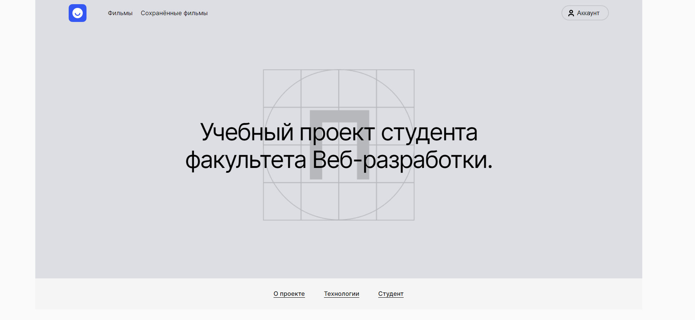
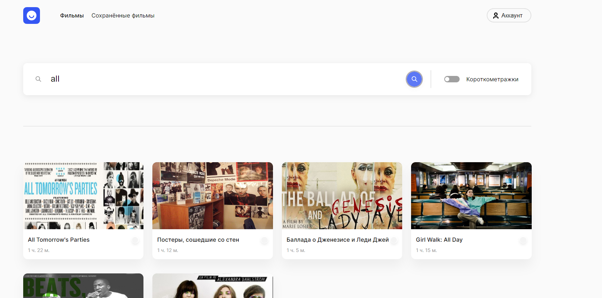
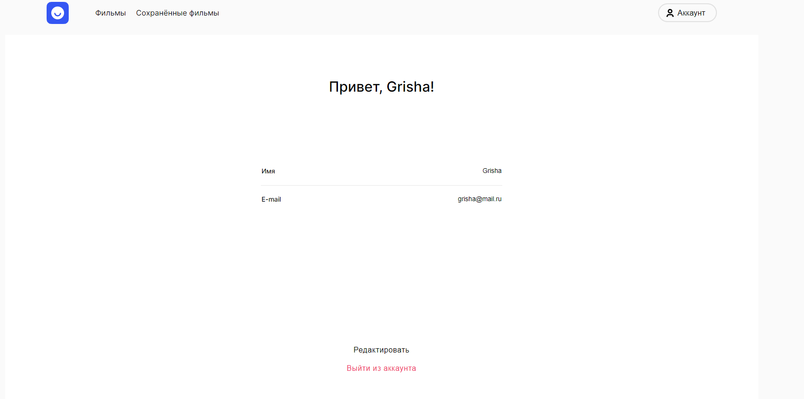
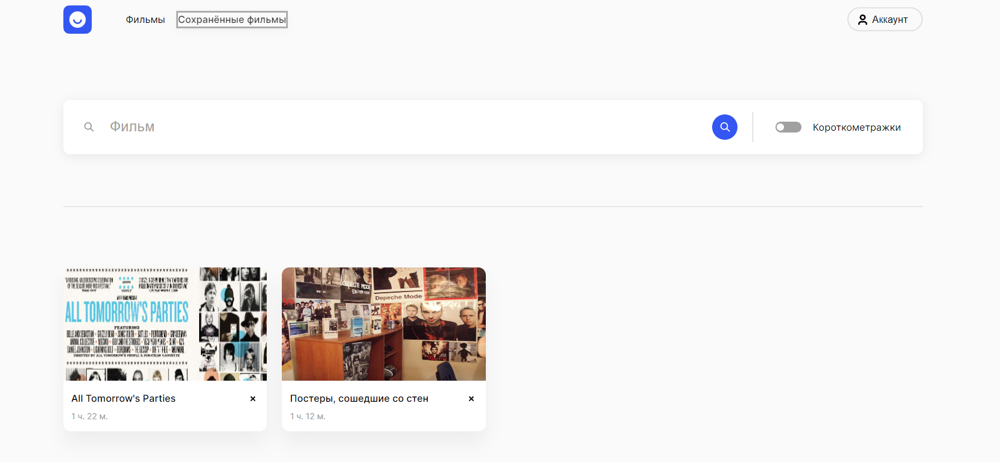
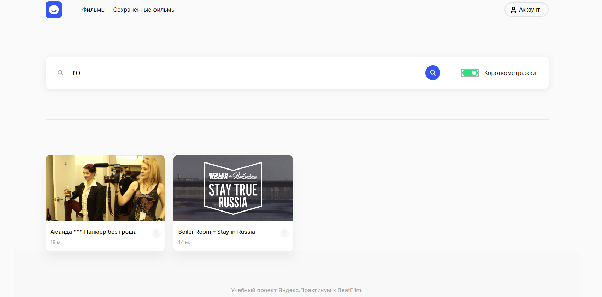

# Дипломная работа: часть 2 - Вёрстка (макет: light-3)
## Разделы проектной работы
* Описание
* Цель
* Используемые технологии
* Функциональность
* Скриншоты
* Инструкция по установке 
* Итог

## Описание
В данной части дипломной работы были отработаны навыки по верстке в CRA. Было сверстано 6-ти страничное мини-приложение по поиску фильмов, включающее также и авторизацию пользователя. Настроена функциональность для полной работы приложения
## Цель
Сверстать визуальную часть согласно макету: light-3
Верстка должна быть адаптивная и резиновая
Реализовать функциональность на стороне клиента
## Используемые технологии
1. Create React App
2. HTML
3. CSS
4. JS
## Функциональность
1. Авторизация и регистрация
2. поиск по стороннему апи
3. сохранение и удаление карточек фильмов пользователем
4. редактирование профиля
5. Хранение данных в localStorage
6. Подключение домменых имен
7. Деплой на Виртуальную Машину
## Скриншоты

## Инструкция по установке
1. Клонировать репозиторий: https://github.com/Se-Un/movies-explorer-frontend
2. Установить зависимости проекта командой: npm ci либо npm install
3. Запустить приложение командой: npm run start 

